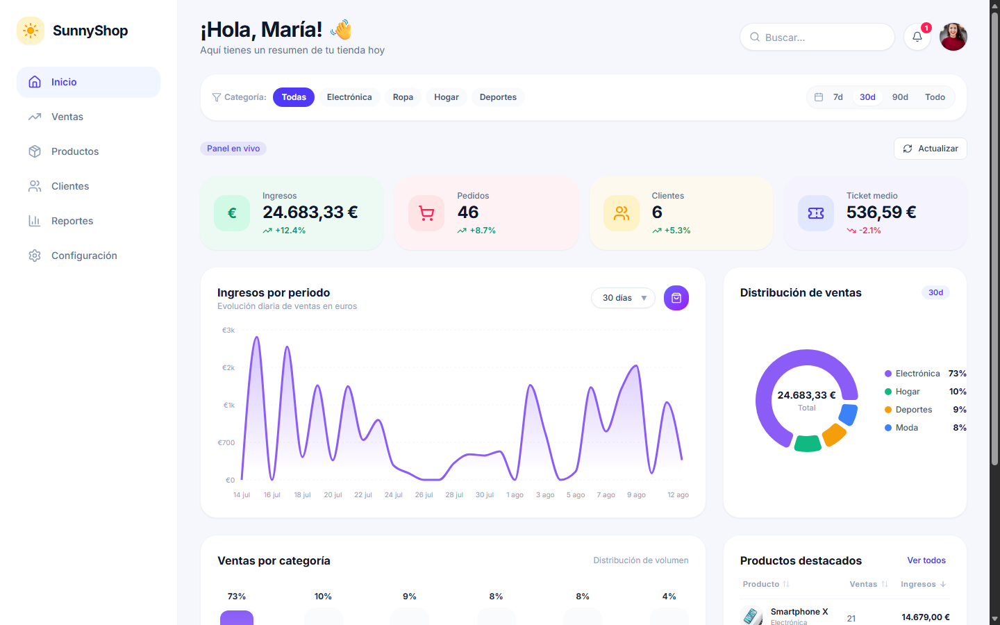
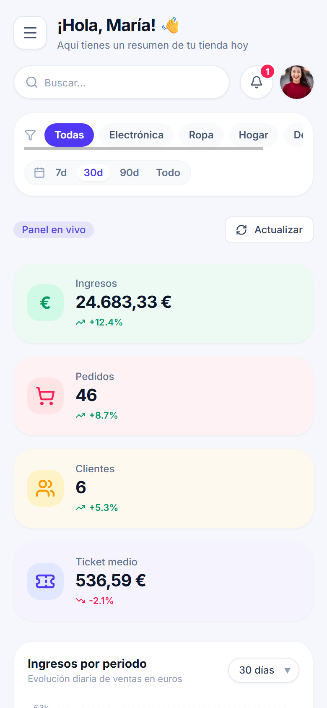

# SunnyShop — Analytics Dashboard 📊

[](https://github.com/alxnrocha/09-analytics-dashboard/actions/workflows/ci.yml)
[](https://react.dev/)
[](https://www.typescriptlang.org/)
[](https://vitejs.dev/)
[](https://tailwindcss.com/)
[](https://tanstack.com/query/latest)
[](https://github.com/pmndrs/zustand)
[](https://recharts.org/)
[](https://vitest.dev/)

> **SunnyShop** es un panel de análisis de ventas moderno, reactivo y accesible para e-commerce. Proporciona visualización en tiempo real de ingresos, pedidos, clientes y ticket medio con desglose por categorías y productos estrella.

---

## 📸 Capturas de Pantalla

### 🖥️ Vista Desktop



### 📱 Vista Mobile (Mobile-First)

<div align="center">
  
</div>

---

## ✨ Características Principales

- **📊 Tarjetas KPI Reactivas:** Ingresos totales (€), número de pedidos, clientes únicos y ticket medio con deltas porcentuales respecto al período anterior.
- **📈 Gráfico de Serie Temporal de Ingresos:** Gráfico de área interactivo con degradado violeta (`Recharts`), selector dinámico de período (7, 30 y 90 días) y tooltips formateados.
- **🍩 Desglose de Ventas por Categoría:** Gráfico de rosca (_Donut_) con total central y leyenda con porcentajes, acompañado de gráfico de barras verticales en formato píldora estilizadas.
- **🏆 Tabla de Productos Destacados:** Construida con `@tanstack/react-table` v8, ordenación por cabeceras, miniaturas y badges de producto estrella (🔥).
- **⚡ Filtros Globales con Zustand + date-fns:** Filtrado reactivo por categoría, rango de fechas y buscador en vivo que actualiza todos los componentes de manera síncrona.
- **🛡️ Resiliencia y Accesibilidad:** `ErrorBoundary` para excepciones no controladas, primitivas `Skeleton` con `role="status"` y `aria-busy`, estados de error con reintento y estado vacío.
- **📱 100% Mobile-First & Responsivo:** Menú lateral tipo cajón con atajo `Escape`, layouts fluidos y áreas de toque accesibles.

---

## 🛠️ Stack Tecnológico

| Capa                         | Tecnología                                                                         |
| :--------------------------- | :--------------------------------------------------------------------------------- |
| **Framework UI**             | [React 19](https://react.dev/) + [Vite 8](https://vitejs.dev/)                     |
| **Lenguaje**                 | [TypeScript 6](https://www.typescriptlang.org/)                                    |
| **Estilos & Tokens**         | [Tailwind CSS v4](https://tailwindcss.com/) (`@theme`)                             |
| **Data Fetching & Cache**    | [@tanstack/react-query v5](https://tanstack.com/query/latest)                      |
| **Estado Global de Filtros** | [Zustand v5](https://github.com/pmndrs/zustand)                                    |
| **Manejo de Fechas**         | [date-fns v4](https://date-fns.org/)                                               |
| **Visualización de Datos**   | [Recharts v3](https://recharts.org/)                                               |
| **Tablas de Datos**          | [@tanstack/react-table v8](https://tanstack.com/table/latest)                      |
| **Iconografía**              | [Lucide React](https://lucide.dev/)                                                |
| **Linter & Formateo**        | [oxlint](https://oxc.rs/) + [Prettier](https://prettier.io/)                       |
| **Testing**                  | [Vitest v4](https://vitest.dev/) + [Testing Library](https://testing-library.com/) |
| **CI / CD**                  | GitHub Actions (`ci.yml`)                                                          |

---

## 📁 Estructura del Proyecto

```text
09-analytics-dashboard/
├── .github/workflows/ci.yml       # Pipeline CI en GitHub Actions
├── docs/                          # Documentación arquitectónica y DER
│   └── schema-erd.md              # Diagrama Entidad-Relación Mermaid
├── sql/                           # Schema SQL relacional
│   └── schema.sql                 # Definición DDL (5 tablas)
├── screenshots/                   # Capturas de pantalla automatizadas
│   ├── desktop.png                # Vista escritorio (1440x900)
│   └── mobile.png                 # Vista móvil (390x844)
├── src/
│   ├── components/
│   │   ├── dashboard/             # Componentes específicos del panel
│   │   │   ├── CategoryBarChart.tsx
│   │   │   ├── FilterBar.tsx
│   │   │   ├── KpiCard.tsx
│   │   │   ├── KpiGrid.tsx
│   │   │   ├── RevenueChart.tsx
│   │   │   ├── SalesDistributionDonut.tsx
│   │   │   └── TopProductsTable.tsx
│   │   ├── layout/                # Shell, Header y Sidebar
│   │   │   ├── DashboardLayout.tsx
│   │   │   ├── Header.tsx
│   │   │   └── Sidebar.tsx
│   │   └── ui/                    # Primitivas UI reutilizables
│   │       ├── Badge.tsx
│   │       ├── Button.tsx
│   │       ├── Card.tsx
│   │       ├── EmptyState.tsx
│   │       ├── ErrorBoundary.tsx
│   │       ├── ErrorState.tsx
│   │       └── Skeleton.tsx
│   ├── data/                      # Dataset sintético de ventas y catálogo
│   │   └── mockData.ts
│   ├── hooks/                     # Custom hooks (TanStack Query)
│   │   └── useDashboardData.ts
│   ├── services/                  # Capa de servicio mock-first con delay
│   │   └── mockApi.ts
│   ├── store/                     # Zustand store global de filtros
│   │   └── filterStore.ts
│   ├── test/                      # Configuración de pruebas Vitest
│   │   └── setup.ts
│   ├── types/                     # Interfaces TypeScript de dominio
│   │   └── analytics.ts
│   ├── utils/                     # Métricas, transformaciones y formateadores
│   │   ├── formatters.ts
│   │   ├── metrics.ts
│   │   └── metrics.test.ts
│   ├── App.tsx                    # Orquestador del Dashboard
│   ├── index.css                  # Tailwind CSS v4 con tokens de diseño
│   └── main.tsx                   # Entrada con ErrorBoundary y QueryClient
├── DECISIONS.md                   # Registro de decisiones de arquitectura (ADR)
├── package.json
└── vite.config.ts
```

---

## 🚀 Inicio Rápido

### Prerrequisitos

- Node.js >= 20.x
- npm >= 10.x

### Instalación

```bash
# Clonar el repositorio
git clone https://github.com/alxnrocha/09-analytics-dashboard.git
cd 09-analytics-dashboard

# Instalar dependencias
npm install
```

### Comandos Disponibles

```bash
# Iniciar servidor de desarrollo en http://localhost:5173
npm run dev

# Ejecutar suite de pruebas con Vitest
npm run test

# Verificar tipos de TypeScript
npm run typecheck

# Ejecutar linter ultrarrápido (oxlint)
npm run lint

# Formatear código con Prettier
npm run format

# Compilar para producción en dist/
npm run build

# Previsualizar build de producción
npm run preview
```

---

## 📐 Modelo de Datos y DER

El proyecto modela una arquitectura relacional completa para comercio electrónico:

- `categories`: Clasificación de catálogo con códigos de color.
- `products`: Catálogo de productos con precio y stock.
- `customers`: Clientes con país y fecha de registro.
- `orders`: Pedidos de compra con estados (_Paid_, _Pending_, _Cancelled_).
- `order_items`: Detalle de productos por pedido con cantidad y precio unitario.

Consulta la definición DDL en [`sql/schema.sql`](sql/schema.sql) y el diagrama interactivo en [`docs/schema-erd.md`](docs/schema-erd.md).

---

## 📜 Registro de Decisiones (ADR)

Para conocer las justificaciones técnicas y los compromisos de diseño adoptados en este proyecto, consulta [`DECISIONS.md`](DECISIONS.md).

---

## 📄 Licencia

Distribuido bajo la Licencia MIT. Consulta `LICENSE` para más información.
