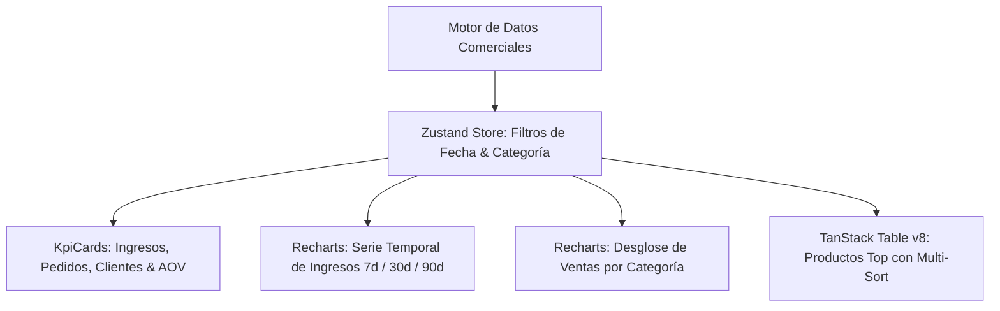

# SunnyShop — Panel de Analíticas & Métricas SaaS E-Commerce

<div align="center">


**Panel de control y analíticas de ventas moderno, reactivo y de alta densidad para comercio electrónico con gráficos Recharts, tablas TanStack Table v8 y filtros globales con Zustand.**

[🚀 Demo en Vivo](https://alxnrocha.github.io/analytics-dashboard/) • [📂 Repositorio en GitHub](https://github.com/alxnrocha/analytics-dashboard)

</div>

---

## 🏛️ Arquitectura y Flujo de Datos



---

## ✨ Características Principales

- **Tarjetas KPI Reactivas:** Ingresos (€), pedidos, clientes únicos y ticket promedio (AOV) con deltas porcentuales respecto al período anterior.
- **Gráfico de Serie Temporal de Ingresos:** Gráfico de área interactivo con Recharts, selector dinámico de período (7, 30 y 90 días) y tooltips contextuales formateados.
- **Desglose de Ventas por Categoría:** Gráfico tipo Donut con total central y distribución porcentual calculada.
- **Tabla de Productos Destacados:** Implementada con `@tanstack/react-table` v8, ordenación por columnas, búsqueda y badges de stock.
- **Filtros Globales con Zustand:** Filtrado por categoría, rango de fechas y buscador con sincronización instantánea en todos los widgets.

---

## 🗂️ Estructura del Proyecto

```text
09-analytics-dashboard/
├── index.html
├── src/
│   ├── components/                # KpiCards, RevenueChart, CategoryDonut, ProductTable
│   ├── data/                      # Fixtures comerciales determinísticas
│   ├── stores/                    # Store global Zustand
│   ├── types/                     # Tipos e interfaces TypeScript
│   ├── App.tsx                    # Componente raíz
│   └── main.tsx                   # Entrada principal React 19
├── package.json
├── tsconfig.json
└── vite.config.ts
```

---

## 🚀 Instalación y Puesta en Marcha

### Prerrequisitos

- Node.js `>= 20.0.0`
- npm `>= 10.0.0`

### Ejecución Local

```bash
# 1. Clonar el repositorio
git clone https://github.com/alxnrocha/analytics-dashboard.git
cd analytics-dashboard

# 2. Instalar dependencias
npm install

# 3. Iniciar servidor de desarrollo
npm run dev

# 4. Compilar para producción
npm run build
```

---

## 🛠️ Tecnologías Utilizadas

| Capa              | Tecnología        | Aspectos Clave                                       |
| ----------------- | ----------------- | ---------------------------------------------------- |
| **Framework**     | React 19          | Hooks modernos, arquitectura desacoplada por widgets |
| **Lenguaje**      | TypeScript 5.8    | Tipado estricto para modelos financieros y métricas  |
| **Estado Global** | Zustand 5.0       | Gestión reactiva de filtros y períodos de análisis   |
| **Tablas**        | TanStack Table v8 | Tabla densa con ordenación y búsqueda                |
| **Visualización** | Recharts 2.15     | Gráficos de área y donut con tooltips personalizados |
| **Estilos**       | Tailwind CSS v4   | Diseño responsive corporativo y micro-animaciones    |
| **Despliegue**    | GitHub Pages      | Despliegue estático continuo y optimizado            |

---

<div align="center">
  <sub>Desarrollado con dedicación por <a href="https://github.com/alxnrocha">Alex Rocha</a> • Proyecto 09 del Portafolio Profesional Frontend.</sub>
</div>
