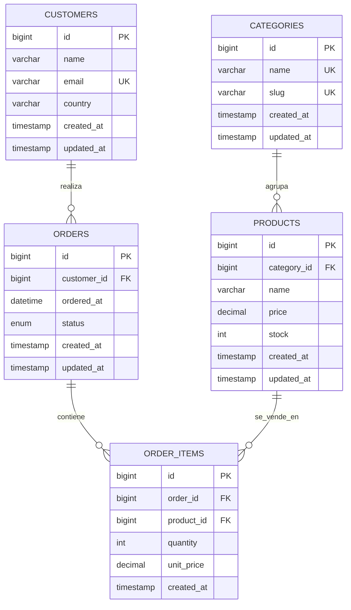

# Modelo de Base de Datos — Analytics Dashboard

Modelo de datos **teórico** del proyecto. La aplicación funciona con datos mockeados en el frontend (`src/utils/mockData.ts` y `src/services/mockApi.ts`); este esquema es la base relacional que soportaría el backend real en una evolución futura.

> **Motor objetivo:** MySQL 8.4 LTS · **Charset:** `utf8mb4` · **Motor de tablas:** InnoDB

## Entidades

| Tabla         | Descripción                                                   |
| :------------ | :------------------------------------------------------------ |
| `categories`  | Categorías de producto (Electrónica, Ropa, Hogar, Deportes).  |
| `customers`   | Clientes que realizan pedidos.                                |
| `products`    | Productos a la venta, asociados a una categoría.              |
| `orders`      | Pedidos de los clientes, con fecha y estado.                  |
| `order_items` | Líneas de cada pedido (producto, cantidad y precio unitario). |

## Diagrama Entidad-Relación (DER)

## Relaciones y reglas de negocio

- **Una categoría agrupa muchos productos** (`1:N`). Una categoría con productos no puede eliminarse (`RESTRICT`).
- **Un cliente realiza muchos pedidos** (`1:N`).
- **Un pedido contiene muchas líneas** (`order_items`, `1:N`). Al eliminar un pedido, sus líneas se eliminan en cascada.
- **Una línea referencia un producto** con `unit_price` (se guarda el precio del momento, no el actual del producto).

## Métricas derivadas (objetivo del dashboard)

| Métrica              | Cálculo SQL                                                 |
| :------------------- | :---------------------------------------------------------- |
| Ingresos totales     | `SUM(oi.quantity * oi.unit_price)`                          |
| Número de pedidos    | `COUNT(DISTINCT o.id)`                                      |
| Ticket medio         | ingresos / pedidos                                          |
| Clientes activos     | `COUNT(DISTINCT o.customer_id)`                             |
| Ventas por categoría | `GROUP BY c.name` sobre el join categorías→productos→líneas |
| Top productos        | `GROUP BY p.name ORDER BY SUM(oi.quantity) DESC`            |

## Correspondencia con el frontend

El mock (`mockData.ts`) expone `sales` (serie temporal), `categories` con valores, `topProducts` y `kpis` — todos derivables de estas tablas. El dashboard aplica filtros por rango de fechas (`orders.ordered_at`) y categoría (`categories.id`).

## Decisiones técnicas

- **`DECIMAL(12,2)`** para dinero (precio y `unit_price`), evitando redondeos de `FLOAT`.
- **`unit_price` en `order_items`** para preservar el precio histórico de cada venta.
- **`CHECK`** para precio y cantidad no negativos.
- **`ordered_at` en `orders`** (tipo `DATETIME`) para permitir filtros temporales exactos del dashboard.
- **Índices** en claves foráneas y en las columnas más filtradas (`ordered_at`, `price`).

## Cómo importarlo

1. Abrir **MySQL Workbench** y conectarse a MySQL 8.4 LTS.
2. Ejecutar `database/schema.sql` para crear la base de datos y las tablas.
3. Ejecutar `database/seed.sql` para poblar datos de ejemplo.
4. El DER editable puede generarse desde MySQL Workbench (_Database → Reverse Engineer_).

> Este modelo es de **estudio** y no se conecta todavía a la aplicación. La conexión real (Node/Express/Sequelize) llega en el proyecto 11.
